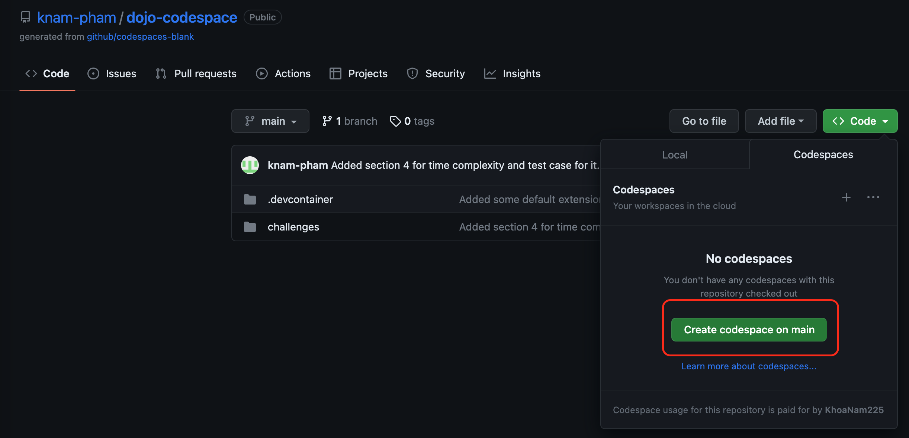

# V-Dojo Challenges

Welcome to V-Dojo Challenges, here you will have the chance to get started in the world of programming by solving a lot of fun and interesting problems!

The challenges are split into different categories increasing in difficulty. At the beginning of each section, there will be some brief explanation on the topic. Going solo or with the team, the choice is yours!

Although the challenges here are solved using the Python programming language, the concepts behind the questions are universal and can be applied to any other languages! We help you build the foundation, it's up to you to decide what tools you want to use!

If this is the first time you have come to this page, please have a look at the instructions below to know how to run your code and tackle all the problems. Have fun coding!

## Instructions

To reduce the overhead of installing/configuring the coding environment in your own laptop. We have decided to use Github Codespace, which will handle all the setup for you so can focus on what truly matter - coding!

In order to access the coding environment, you will need to have a Github account. Registering for a new one is totally free, you can access the signup page [here](https://github.com/signup?ref_cta=Sign+up&ref_loc=header+logged+out&ref_page=%2F&source=header-home).

After having a Github account, you will need to access the Github repository where we host all the questions by following this [link](https://github.com/knam-pham/dojo-codespace).

Once you're in the repository, click on the green button labeled "Code" like the below image:

Another menu will popup, since you're here for the first time, no codespace was created for you, you can click on the button labeled "Create codespace on main" like below

After that, Github will start creating and configuring everything you need to start coding and running your code. Once it's finish, you will see a window that looks like a text editor with some file structure on the left. You can expand the "challenges" folder and double-click on the file "1_variables.ipynb". If you see something like this, congratulations! You have finished the setting up. Now all you need to do is having fun!

**NOTE**: If you have created a codespace on this repository before and access it again, you won't have to create a new codespace. When you click on "Code" button, Github will display a list of codespaces that were already created, you can just click on one of them to continue working.